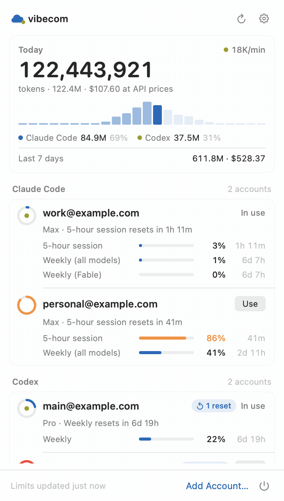
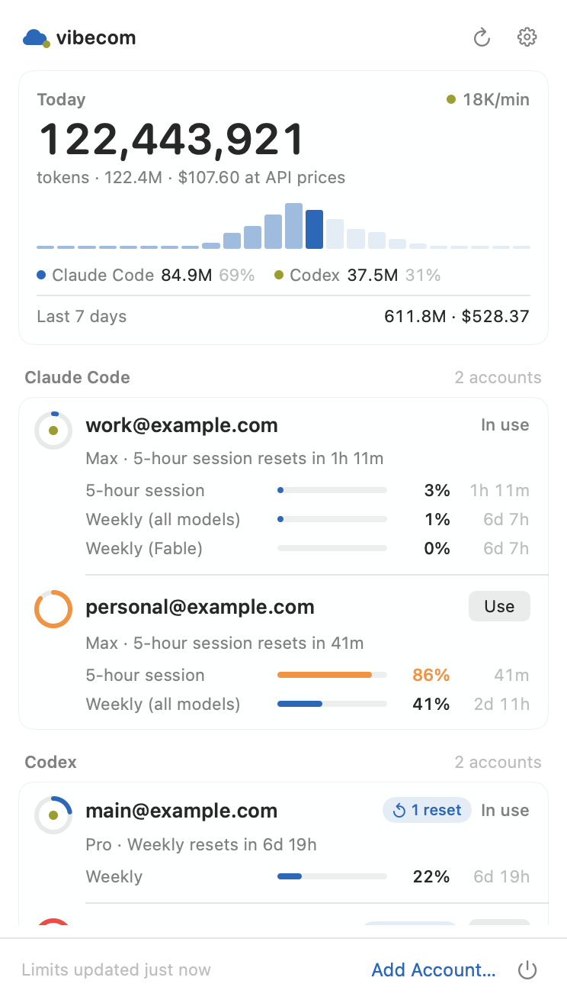
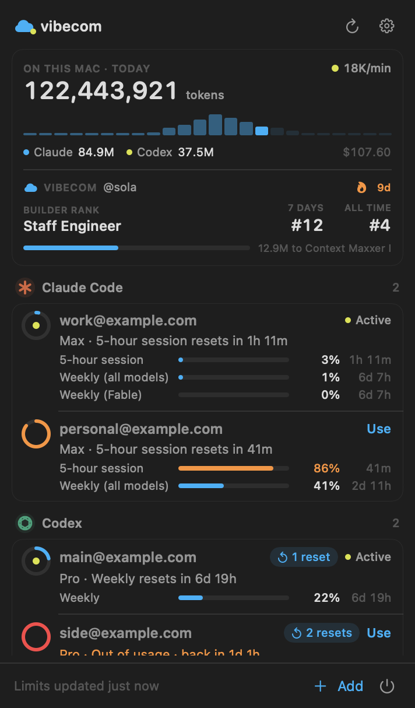
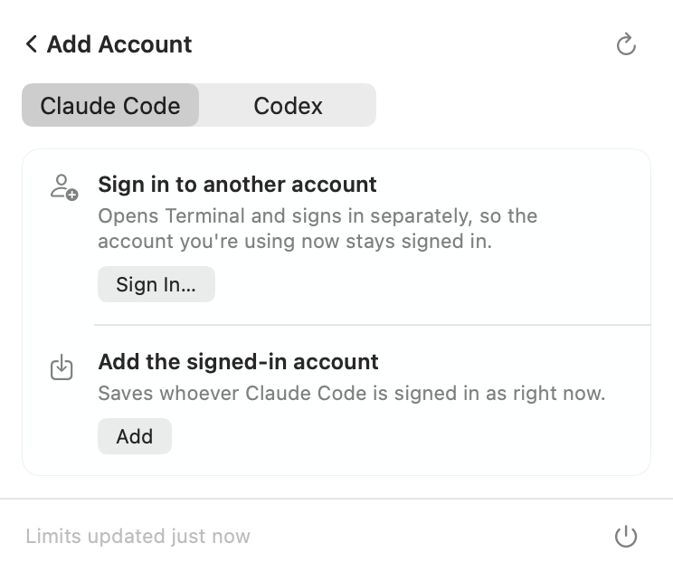

<div align="center">


# vibecom bar

### All your Claude Code and Codex accounts. Right in the menu bar.

See usage. Follow resets. Switch accounts when you choose.

[](https://github.com/DugboTek/vibecom-bar/actions/workflows/ci.yml)
[](https://github.com/DugboTek/vibecom-bar/releases/latest)
[](https://github.com/DugboTek/vibecom-bar/stargazers)
[](LICENSE)

[Website](https://vibecom.build/bar) · [Get started](docs/getting-started.md) · [Security](docs/security-model.md) · [Help](docs/troubleshooting.md)

</div>

---

<p align="center">
  <a href="https://vibecom.build/bar"></a>
</p>

## One place for every account

Vibecom Bar brings Claude Code and Codex together in a native Mac app. Your
accounts, usage windows, reset times, and local token activity are always one
click away.

No tabs to keep open. No account spreadsheets. No wondering which login your
next session will use.

### See what is available

View every saved account and its current limits. The account closest to a
limit rises to the top, with its reset time shown beside it.

### Switch when it makes sense

Choose the account you want Claude Code or Codex to use next. Nothing changes
until you ask. Or turn on Auto Swap to move at 99% to the available account
whose next reset is soonest.

### Follow your work as it happens

See today's tokens, your live token rate, and estimated API value across both
tools. If you use Vibecom, your builder rank, weekly standing, all-time
standing, streak, and progress to the next rank appear alongside them.

## Install

Vibecom Bar requires macOS 14 or newer and Claude Code, Codex, or both.

The signed download is coming with the first release. For now, build it from
source:

```bash
git clone https://github.com/DugboTek/vibecom-bar.git
cd vibecom-bar
./scripts/build-app.sh
open "Vibecom Bar.app"
```

Then open the cloud in your menu bar and choose **Add account**.

[Read the getting-started guide →](docs/getting-started.md)

## Private by design

Your credentials stay in macOS Keychain. Your conversations, responses, and
source code stay on your Mac.

Vibecom Bar reads usage from the providers and token totals from the local
files their CLIs already create. It does not upload your coding activity to
vibecom.build, and it never switches an account unless you choose **Use**.

- Credentials are protected by macOS Keychain.
- Saved account details remain local to your Mac.
- Message content is never included in token totals.
- Claude Code remains in control of its active login.

[See exactly how credentials are handled →](docs/security-model.md)

## Looks at home on your Mac

| Light | Dark |
|---|---|
|  |  |

<p align="center"></p>

## Built in the open

Vibecom Bar is written in Swift and licensed under MIT. The full source,
security model, tests, and release process are here for anyone to inspect.

```bash
swift test
swift build
```

The offline test suite covers account storage, switching, usage, token totals,
alerts, and provider responses without touching your real logins.

| Learn more | |
|---|---|
| [Getting started](docs/getting-started.md) | Add your first Claude or Codex account |
| [Security](docs/security-model.md) | Learn where credentials and account details live |
| [Troubleshooting](docs/troubleshooting.md) | Get help with login, usage, and menu behavior |
| [Contributing](CONTRIBUTING.md) | Build the app and propose changes |
| [Support](SUPPORT.md) | Find the right place to ask for help |

---

<div align="center">

Part of [vibecom](https://vibecom.build), the community for AI builders.

[MIT](LICENSE) © 2026 DugboTek

</div>
